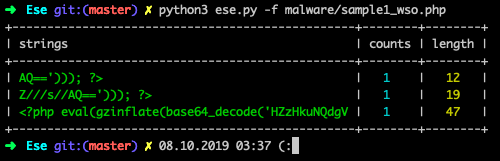
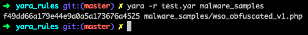
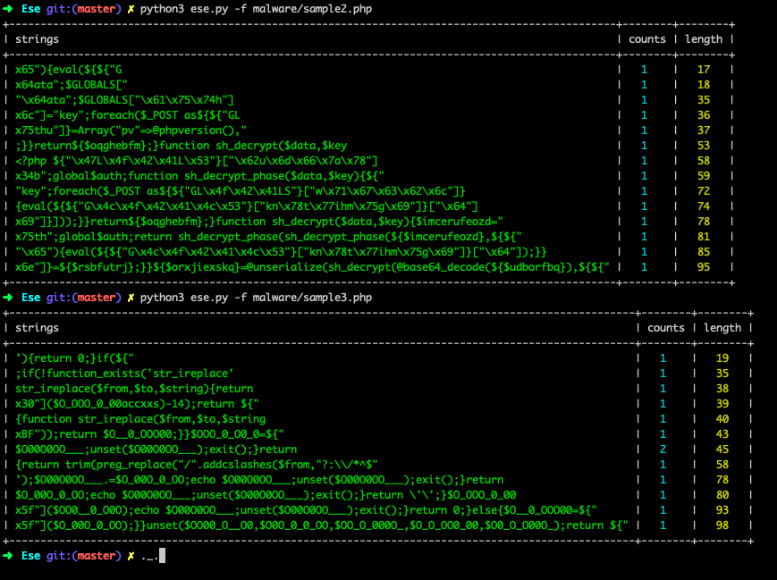

### alpha version!

#### Example pattern extraction and spelling the rule:

- Get patterns:
```
➜  Ese git:(master) ✗ python3 ese.py -f malware/sample1_wso.php
```
- See output:



- Write example rule:
```
rule f49dd66a179e44e9a0a5a173676a4525: phpshell
{
    meta:
        author = "delyee"
        date = "07.10.2019"
        sha256sum = "1c62a00fe13fbff09ebc16cf408f5d9f53a285fc1014438c2a488e3f6d2b65bc"
    strings:
        $ = "<?php eval(gzinflate(base64_decode('HZzHkuNQdgV"
        $ = "Z///s//AQ=='))); ?>"
    condition:
        all of them
}
```

- Result:



#### Other results:


